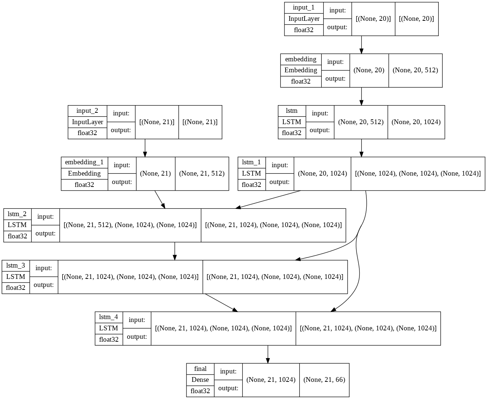

# Vanilla Seq2Seq Model
## This is the vanilla transliteration model developed using RNNs (RNN, LSTM and GRU)
The folder contains the follwing files:  
1. CS6910_vanilla_seq2seq.ipynb - The ipynb file containing the entire code for the experimentation. It can be executed entirely on its own.  
2. best_train.py - The python file that is used for the training and evaluation of the best model.
3. inference.py - The python file used for inferencing the model
4. model.py - The python file containg the entire model template using encoder and decoder architecture
5. predict.py - The python file that will be used to get the predictions of the best model on the test data
6. train_Hyperprameter_Tuning.py - The python file is for performing the sweeps or the hyperparameter tuning of the model for some parameters
7. util.py This python file contains some functions that can be used as utilitary functions for the training and the model development and testing of the model.  
## The Best model architecture can be visualized as follows  

## Execution of the code.
1. upload the below .ipynb file and Run every cell except the cells marked as to be run only for HyperParamter Tuning to train and evaluate the best performing model.
```
CS6910_vanilla_seq2seq.ipynb
```
2. Download the Github Repository -> Keep all the files in the same folder -> Run the below mentioned .py file as follows.
```
python3 best_train.py
```
